# Algorithm Flow Diagrams

**Date**: 2025-11-24
**Version**: 2.2
**Status**: Production Ready

---

## Table of Contents

1. [Overshooting Detection Flow](#overshooting-detection-flow)
2. [Undershooting Detection Flow](#undershooting-detection-flow)
3. [RSRP-Based Competition Logic](#rsrp-based-competition-logic)
4. [Data-Driven Coverage Impact Calculation](#data-driven-coverage-impact-calculation)

---

## Overshooting Detection Flow

### High-Level Overview

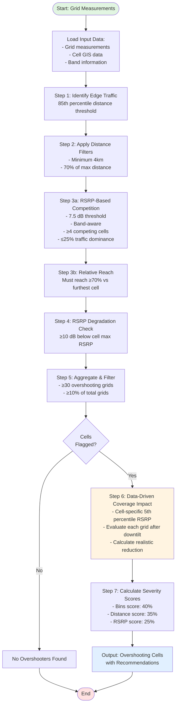

### Detailed Step-by-Step Flow

```mermaid
flowchart TD
    subgraph InputData [" Input Data Preparation "]
        A1[Grid DataFrame<br/>geohash7, cell_id, Band,<br/>rsrp, rsrq, distance_m,<br/>total_traffic]
        A2[GIS DataFrame<br/>cell_id, latitude, longitude,<br/>azimuth, tilt, height]
        A1 --> A3[Merge & Prepare Data]
        A2 --> A3
    end

    subgraph Step1 [" Step 1: Edge Traffic Identification "]
        B1[Calculate 85th Percentile<br/>Distance per Cell]
        B2[Filter Bins ≥ Threshold]
        B1 --> B2
        B3[Edge Bins DataFrame]
        B2 --> B3
    end

    subgraph Step2 [" Step 2: Distance Filters "]
        C1{Distance<br/>≥ 4000m?}
        C2{Distance ≥ 70%<br/>of Cell Max?}
        C1 -->|Yes| C2
        C1 -->|No| C3[Discard Bin]
        C2 -->|Yes| C4[Keep Bin]
        C2 -->|No| C3
    end

    subgraph Step3a [" Step 3a: RSRP Competition "]
        D1[Calculate P90 RSRP<br/>per Grid+Band]
        D2[Calculate RSRP Diff<br/>for Each Cell]
        D3{RSRP Diff<br/>≤ 7.5 dB?}
        D4[Mark as Competing]
        D5[Not Competing]
        D6[Count Competing<br/>Cells per Grid]
        D7{≥4 Competing<br/>Cells?}
        D8{Cell Traffic<br/>≤25% of Grid?}

        D1 --> D2 --> D3
        D3 -->|Yes| D4 --> D6
        D3 -->|No| D5 --> D6
        D6 --> D7
        D7 -->|Yes| D8
        D7 -->|No| D9[Discard Bin]
        D8 -->|Yes| D10[Keep Bin]
        D8 -->|No| D9
    end

    subgraph Step3b [" Step 3b: Relative Reach "]
        E1[Find Max Distance<br/>to Grid from Any Cell]
        E2[Calculate Relative Reach<br/>= cell_dist / max_dist]
        E3{Relative<br/>Reach ≥ 70%?}
        E4[Keep Bin]
        E5[Discard Bin<br/>Another cell is overshooter]

        E1 --> E2 --> E3
        E3 -->|Yes| E4
        E3 -->|No| E5
    end

    subgraph Step4 [" Step 4: RSRP Degradation "]
        F1[Get Cell Max RSRP<br/>Across All Bins]
        F2[Calculate Threshold<br/>= max_rsrp - 10 dB]
        F3{Bin RSRP<br/>≤ Threshold?}
        F4[Keep Bin<br/>Signal Degraded]
        F5[Discard Bin<br/>Signal Still Strong]

        F1 --> F2 --> F3
        F3 -->|Yes| F4
        F3 -->|No| F5
    end

    subgraph Step5 [" Step 5: Cell Aggregation "]
        G1[Count Overshooting<br/>Bins per Cell]
        G2[Calculate Percentage<br/>= overshoot_bins / total_bins]
        G3{≥30 Bins<br/>AND ≥10%?}
        G4[Flag as Overshooter]
        G5[Not an Overshooter]

        G1 --> G2 --> G3
        G3 -->|Yes| G4
        G3 -->|No| G5
    end

    subgraph Step6 [" Step 6: Data-Driven Coverage Impact "]
        H1[Get ALL Cell Grids<br/>from grid_with_distance]
        H2[Calculate Cell-Specific<br/>5th Percentile RSRP]
        H3[For Each Grid:<br/>Calculate RSRP Reduction<br/>After 1° and 2° Downtilt]
        H4[New RSRP = Current - Reduction]
        H5{New RSRP ≥<br/>P5 Threshold?}
        H6[Grid Remains Served]
        H7[Grid Lost]
        H8[New Max Distance =<br/>Furthest Remaining Grid]
        H9[Calculate Coverage<br/>Reduction Percentage]

        H1 --> H2 --> H3 --> H4 --> H5
        H5 -->|Yes| H6 --> H8
        H5 -->|No| H7 --> H8
        H8 --> H9
    end

    subgraph Step7 [" Step 7: Severity Scoring "]
        I1[Normalize Metrics<br/>to 0-1 Scale<br/>Using P5-P95]
        I2[Bins Score: 40%]
        I3[Distance Score: 35%]
        I4[RSRP Score: 25%]
        I5[Weighted Sum]
        I6[Assign Category:<br/>CRITICAL/HIGH/MEDIUM/LOW/MINIMAL]

        I1 --> I2
        I1 --> I3
        I1 --> I4
        I2 --> I5
        I3 --> I5
        I4 --> I5
        I5 --> I6
    end

    A3 --> B1
    B3 --> C1
    C4 --> D1
    D10 --> E1
    E4 --> F1
    F4 --> G1
    G4 --> H1
    H9 --> I1
    I6 --> Output[Output DataFrame]

    style InputData fill:#e1f5e1
    style Step6 fill:#fff4e1
    style Output fill:#e1f0ff
```

---

## Undershooting Detection Flow

### High-Level Overview

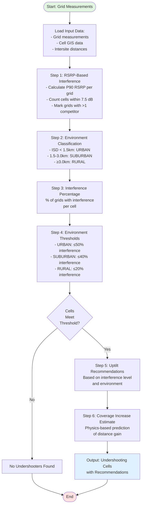

### Detailed Step-by-Step Flow

```mermaid
flowchart TD
    subgraph InputData [" Input Data Preparation "]
        A1[Grid DataFrame<br/>geohash7, cell_id,<br/>rsrp, distance_m]
        A2[GIS DataFrame<br/>cell_id, latitude, longitude,<br/>azimuth, tilt, height,<br/>intersite_distance]
        A1 --> A3[Merge & Prepare Data]
        A2 --> A3
    end

    subgraph Step1 [" Step 1: RSRP-Based Interference "]
        B1[Calculate P90 RSRP<br/>per Grid Bin]
        B2[For Each Cell in Grid:<br/>Calculate RSRP Difference]
        B3{RSRP Diff<br/>≤ 7.5 dB?}
        B4[Mark as Competing]
        B5[Not Competing]
        B6[Count Competing<br/>Cells per Grid]
        B7{>1 Competing<br/>Cell?}
        B8[Grid Has Interference]
        B9[Grid Low Interference]

        B1 --> B2 --> B3
        B3 -->|Yes| B4 --> B6
        B3 -->|No| B5 --> B6
        B6 --> B7
        B7 -->|Yes| B8
        B7 -->|No| B9
    end

    subgraph Step2 [" Step 2: Environment Classification "]
        C1[Get Intersite<br/>Distance ISD]
        C2{ISD<br/>< 1.5km?}
        C3[URBAN]
        C4{ISD<br/>< 3.0km?}
        C5[SUBURBAN]
        C6[RURAL]

        C1 --> C2
        C2 -->|Yes| C3
        C2 -->|No| C4
        C4 -->|Yes| C5
        C4 -->|No| C6
    end

    subgraph Step3 [" Step 3: Calculate Interference % "]
        D1[Count Total Grids<br/>per Cell]
        D2[Count Grids with<br/>Interference per Cell]
        D3[Calculate Percentage<br/>= interference_grids / total_grids]

        D1 --> D3
        D2 --> D3
    end

    subgraph Step4 [" Step 4: Apply Environment Thresholds "]
        E1{Environment<br/>Type?}
        E2{URBAN:<br/>≤50% && ≥15 grids?}
        E3{SUBURBAN:<br/>≤40% && ≥10 grids?}
        E4{RURAL:<br/>≤20% && ≥5 grids?}
        E5[Flag as Undershooter]
        E6[Not an Undershooter]

        E1 -->|URBAN| E2
        E1 -->|SUBURBAN| E3
        E1 -->|RURAL| E4
        E2 -->|Yes| E5
        E2 -->|No| E6
        E3 -->|Yes| E5
        E3 -->|No| E6
        E4 -->|Yes| E5
        E4 -->|No| E6
    end

    subgraph Step5 [" Step 5: Uptilt Recommendations "]
        F1[Calculate Safe Uptilt<br/>Based on Interference %]
        F2[Lower Interference<br/>= More Aggressive Uptilt]
        F3[Typical Range:<br/>+1° to +2°]

        F1 --> F2 --> F3
    end

    subgraph Step6 [" Step 6: Coverage Increase Estimate "]
        G1[Use 3GPP Antenna Pattern<br/>+ Log-Distance Model]
        G2[Calculate Gain Increase<br/>from Uptilt]
        G3[Estimate New Max Distance]
        G4[Calculate Coverage<br/>Increase Percentage]
        G5[Estimate New Coverage<br/>Grid Count]

        G1 --> G2 --> G3 --> G4 --> G5
    end

    A3 --> B1
    B8 --> C1
    B9 --> C1
    C3 --> D1
    C5 --> D1
    C6 --> D1
    D3 --> E1
    E5 --> F1
    F3 --> G1
    G5 --> Output[Output DataFrame]

    style InputData fill:#e1f5e1
    style Output fill:#e1f0ff
```

---

## RSRP-Based Competition Logic

### Conceptual Flow

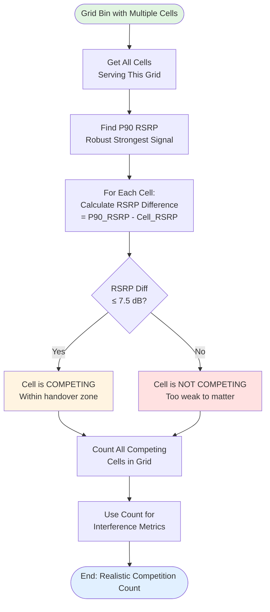

### Why 7.5 dB Threshold?

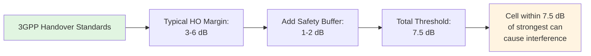

### Example: Grid with 5 Cells

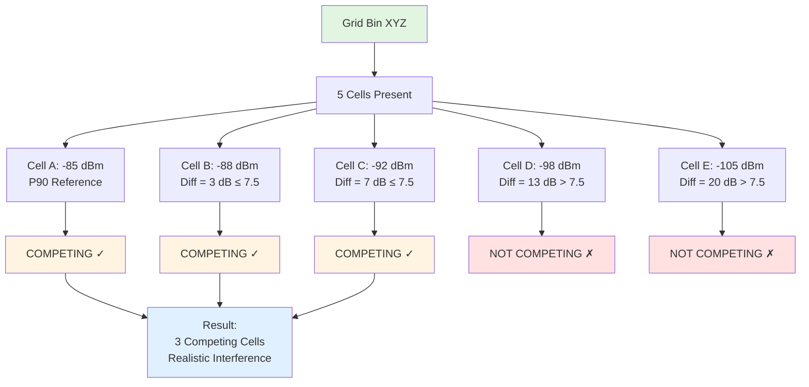

---

## Data-Driven Coverage Impact Calculation

### Overview: Why Data-Driven?

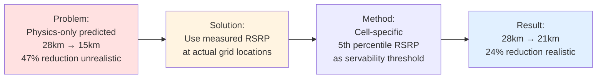

### Detailed Calculation Flow

```mermaid
flowchart TD
    Start([Cell Flagged as Overshooter]) --> A[Get ALL Grids<br/>Served by Cell<br/>Not just overshooting ones]

    A --> B[Calculate Cell-Specific<br/>5th Percentile RSRP<br/>p5_rsrp = quantile0.05]

    B --> C[Initialize:<br/>remaining_grids_1deg = []<br/>remaining_grids_2deg = []]

    C --> D[For Each Grid in Cell]

    D --> E[Get Grid Distance<br/>and Current RSRP]

    E --> F[Calculate Elevation Angle<br/>θ = arctan height / distance]

    F --> G1[Calculate RSRP Reduction<br/>After 1° Downtilt<br/>Using 3GPP Pattern]

    F --> G2[Calculate RSRP Reduction<br/>After 2° Downtilt<br/>Using 3GPP Pattern]

    G1 --> H1[new_rsrp_1deg =<br/>current_rsrp - reduction_1deg]
    G2 --> H2[new_rsrp_2deg =<br/>current_rsrp - reduction_2deg]

    H1 --> I1{new_rsrp_1deg<br/>≥ p5_rsrp?}
    H2 --> I2{new_rsrp_2deg<br/>≥ p5_rsrp?}

    I1 -->|Yes| J1[Grid Still Servable<br/>Add to remaining_1deg]
    I1 -->|No| K1[Grid Lost<br/>Below threshold]

    I2 -->|Yes| J2[Grid Still Servable<br/>Add to remaining_2deg]
    I2 -->|No| K2[Grid Lost<br/>Below threshold]

    J1 --> L{More<br/>Grids?}
    J2 --> L
    K1 --> L
    K2 --> L

    L -->|Yes| D
    L -->|No| M[New Max Distance 1° =<br/>maxremaining_1deg]

    M --> N[New Max Distance 2° =<br/>maxremaining_2deg]

    N --> O[Coverage Reduction % =<br/>current_max - new_max / current_max]

    O --> End([End: Realistic<br/>Coverage Predictions])

    style Start fill:#e1f5e1
    style B fill:#fff4e1
    style End fill:#e1f0ff
```

### Cell-Specific 5th Percentile Threshold

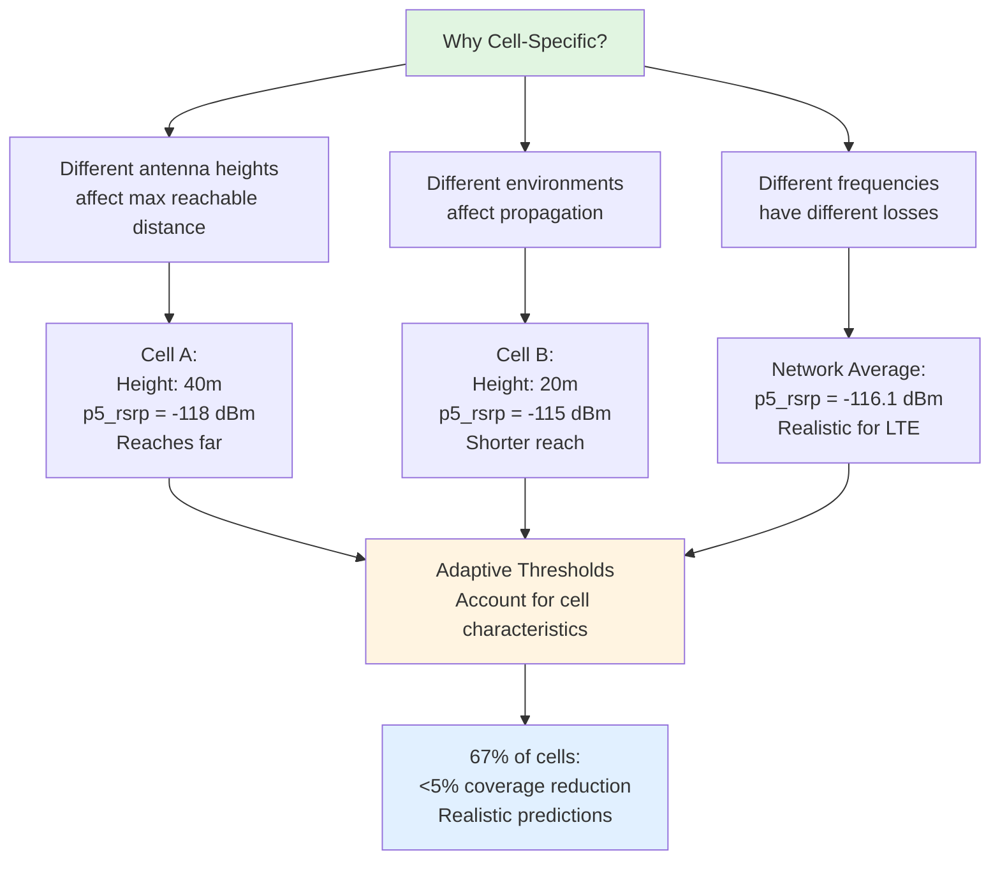

### RSRP Reduction Calculation (3GPP Antenna Pattern)

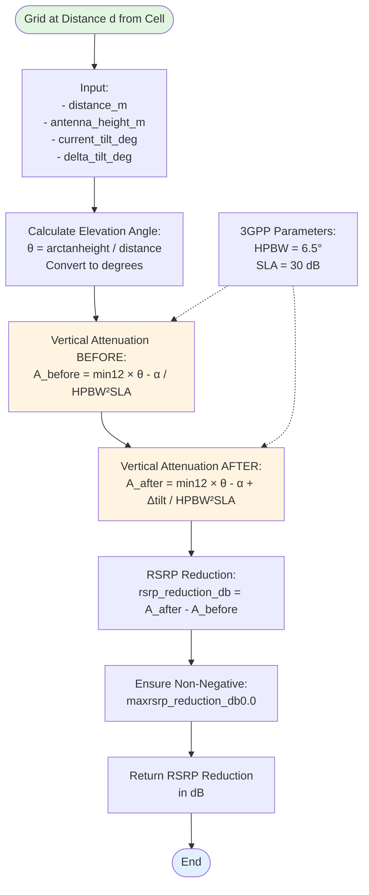

### Coverage Reduction Distribution

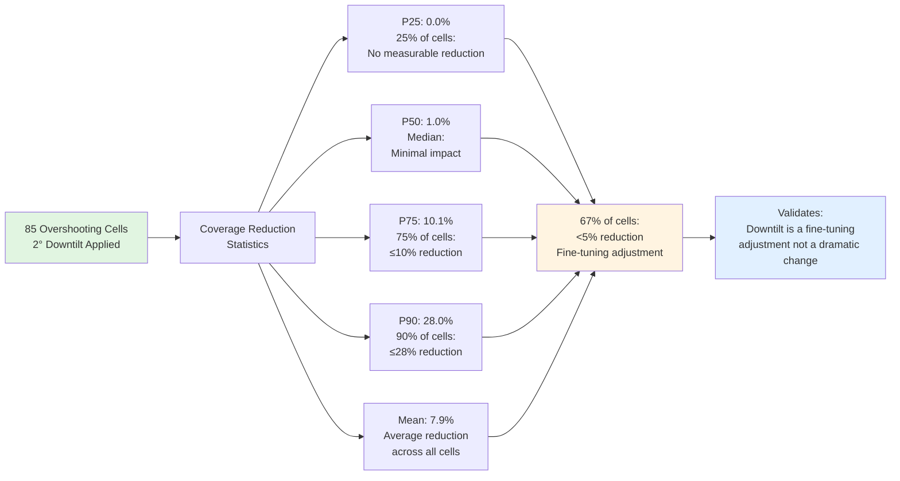

---

## Legend

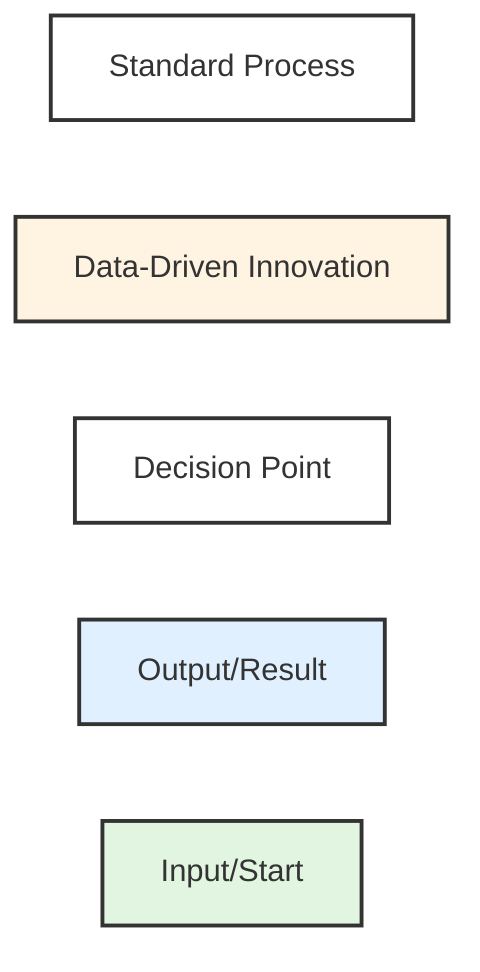

---

**Notes**:
- All diagrams use Mermaid syntax and can be rendered in GitHub, Obsidian, or any Mermaid-compatible viewer
- Color coding highlights key innovations (yellow) and data flow (green→blue)
- Decision diamonds show filtering logic with Yes/No paths
- Subgraphs group related steps for clarity
